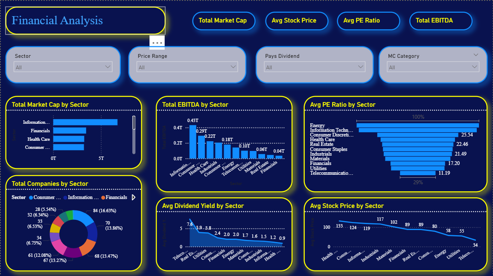

# 📊 Financial Market Analysis Using Power BI

## 📌 Project Overview

This project presents an interactive Financial Market Analysis Dashboard developed using Power BI.  
The dashboard provides insights into:

- Sector Performance
- Market Capitalization & EBITDA Trends
- Valuation Multiples (P/E, P/S, P/B Ratios)
- Dividend Yield Distributions
- Stock Price Ranges & 52-Week Price Movements

The goal of this project is to transform raw financial market data into meaningful business insights using visualization techniques.

---

# 🛠 Tools Used

- Power BI
- Excel / CSV Dataset
- Data Cleaning
- DAX Measures
- Data Visualization

---

# 📂 Dataset

The dataset contains corporate financial performance information including:

- Company Names & Ticker Symbols
- GICS Sector Classifications
- Stock Prices & 52-Week Highs/Lows
- Valuation Metrics (Price/Earnings, Price/Sales, Price/Book)
- Financial Fundamentals (Market Cap, EBITDA, Earnings/Share)
- Dividend Yields & SEC Filing Links

---

# 📸 Dashboard Screenshots

## Main Dashboard

---

# 📈 Key Insights

- Identified top-performing sectors based on total Market Capitalization and EBITDA
- Analyzed dividend yield distributions across various sectors to detect high-yield segments
- Compared valuation metrics like P/E and P/B ratios across industries to identify overvalued or undervalued stocks
- Tracked corporate stock trends against their 52-week highs and lows to measure market volatility
- Created KPI cards for quick tracking of total market cap, average EBITDA, and overall market price metrics

---

# 🚀 Features

- Interactive Filters
- Dynamic Visualizations
- KPI Metrics
- Drill-down Analysis
- Business Insights

---

# 📁 Project Files

- `.pbix` Power BI File
- Dataset
- Dashboard Screenshots
- README Documentation

---

# 👨‍💻 Author

Jatin Kumar
